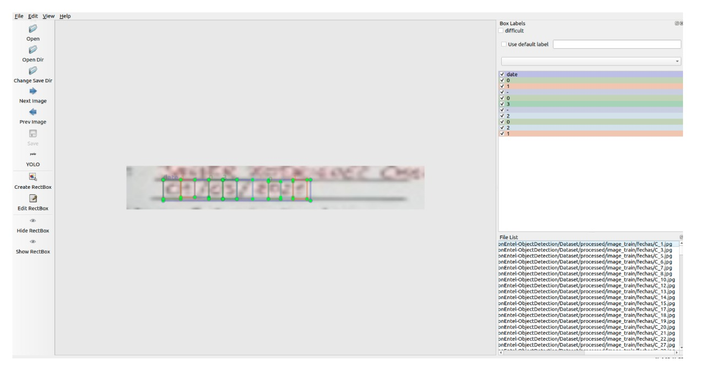

# DATATHON ENTEL 2021 - DETECCIÓN DE OBJETOS

## Team InsightML : 
    - Cristian Lazo Quispe
    - William Berrios Rojas
    - Renato Castro Cruz

## Challenge description
[Link to Datathon](https://www.kaggle.com/c/datathon-entel-2021-reto1/data)

    The challenge involves developing an object detection and OCR model to automate the review of documents that a technician collects during each installation visit and that are then manually reviewed when they are delivered to their base, which could lead to human error.
    

    

## Target

    For this challenge we are only asked to determine the location of 3 fields of the format (2 signatures and 1 date) and to obtain the handwritten date separated in day month and year.

    

## Solution

    Our solution is divided in 3 main parts:

    01. Pre-processing images

        Image aligment and standarization of orientation, size, proportion and JGP format.

    

    02. Sign detection model

        CNN architecture to binary classification in order to know is the sign is present or not.

    

    

    03. Date recognition model

        CNN-based object detection approach for recognizing date characters

    

## Getting Started

    01. Clone our repository

        $ git clone https://github.com/williamberrios/Datathon-Entel-Object-Dectection.git

    02. Downloading dataset
        
        https://www.kaggle.com/c/datathon-entel-2021-reto1/data
    
    03. Prepare your enviroment

        $ pip install -r requirements.txt

    You can follow the whole methodology to obtain our results, or you can go directly to step 09.Main to process the test data with the trained models.
    
    # Donwload pytorch date recognition model and save it in 03.SavedModels folder

        https://drive.google.com/file/d/1jaB_hQHKX4s_s0suTp765D8nP2_JkX84/view?usp=sharing

    04. Pre-processing dataset

        $ cd 02.Codes
        $ cd 01.PeprocesingImages
        $ python ImagePreprocessing.py

        After the pre-processing we obtain this structure:

        ├processed        
        ├── images_test
        │   ├── aligned
        │   ├── fechas
        │   └── firmas
        └── images_train
            ├── aligned
            ├── fechas
            ├── firmas
            └── firmas_modelo
                ├── 1
                ├── 0
                └── modelamiento

    05. Labeling TRAIN dataset 

        Once we have obtained the aligned image of the date, we can do the labeling of each character using the free software labelImg

    

        After that, we obtain this structure:

        ├labeling        
        ├── train
        └── classes.txt

    06. Training sign model detection

        $ cd 02.Codes
        $ cd 02.ModeloFirmas
        $ python training.py
    

    

    07. Evaluate sign model detection

        $ cd 02.Codes
        $ cd 02.ModeloFirmas
        $ python evaluate.py

    

    08. Trainig date recognition model

        $ cd 02.Codes
        $ cd 03.ModeloFechas
        $ #run jupyter notebook  01.GenerateDataset-Fechas.ipynb
        $ python train.py

    09. Main process

        $ cd 02.Codes
        $ cd 04.Main
        $ #run jupyter notebook 01-Main.ipynb

        We obtain the final submission 

        ├── 01-Main.ipynb
        ├── config.py
        └── submissions
            ├── final_submission.csv
            └── submission_.csv

