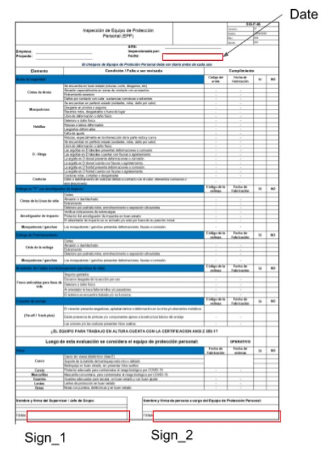
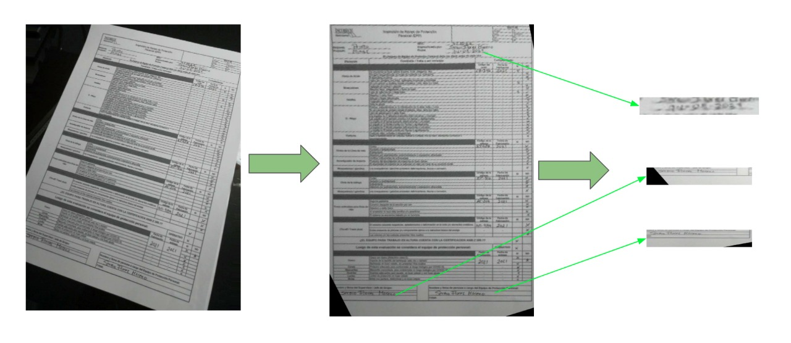
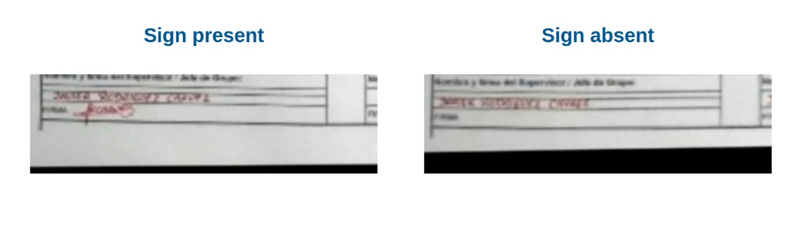
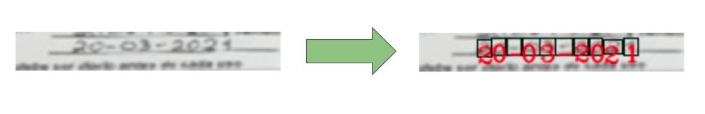
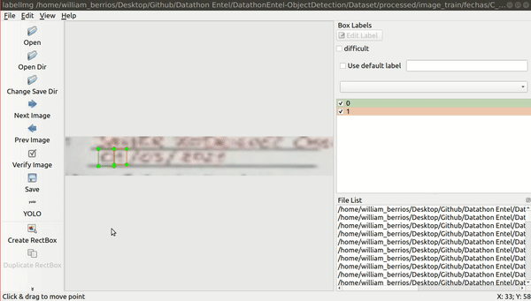
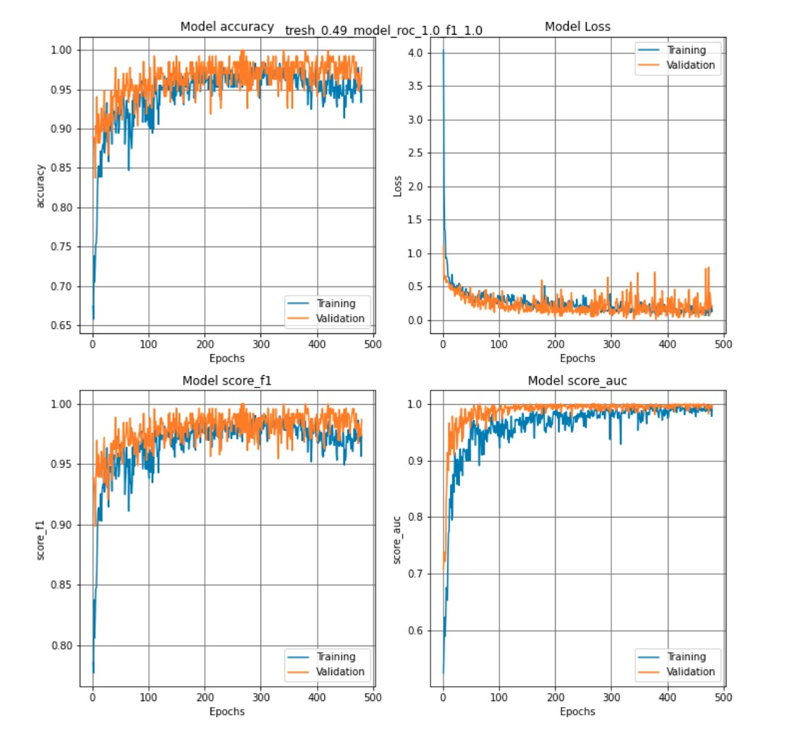
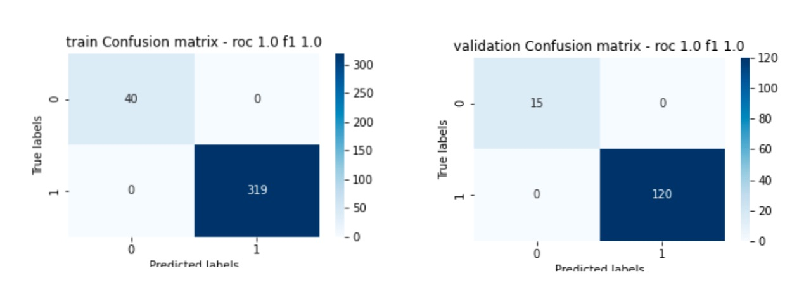

<!-- #region -->
<p align="center">
    
</p>


## Objective

The [challenge](https://www.kaggle.com/c/datathon-entel-2021-reto1/data) involves developing an object detection and OCR model to automate the review of documents that a technician collects during each installation visit and that are then manually reviewed when they are delivered to their base, which could lead to human error.
    
## Description

For this challenge we are only asked to determine the location of 3 fields of the format (2 signatures and 1 date) and to obtain the handwritten date separated in day month and year.

<p align="center">
    
</p>

<!-- #endregion -->

## Solution

Our solution is divided in 3 main parts:

### 01. Pre-processing images

Image aligment and standarization of orientation, size, proportion and JGP format.

<p align="center">
    
</p>

### 02. Sign detection model

CNN architecture to binary classification in order to know is the sign is present or not.

<p align="center">
    
</p>

### 03. Date recognition model

FasterRCNN - based object detection approach for recognizing date characters

<p align="center">
    
</p>


## Getting Started


### 1. Clone our repository

```shell
$ git clone https://github.com/williamberrios/Datathon-Entel-Object-Dectection.git
```
### 2. Downloading dataset
        
    https://www.kaggle.com/c/datathon-entel-2021-reto1/data
    
## 3.Prepare your enviroment
```shell
$ pip install -r requirements.txt
```

    You can follow the whole methodology to obtain our results, or you can go directly to step "9" to process the test data with the trained models.
        
    Donwload pytorch date recognition model and save it in 03.SavedModels folder

    https://drive.google.com/file/d/1jaB_hQHKX4s_s0suTp765D8nP2_JkX84/view?usp=sharing


### 4.Pre-processing dataset
```shell
$ cd 02.Codes
$ cd 01.PeprocesingImages
$ python ImagePreprocessing.py
```
    After the pre-processing we obtain this structure:

        ├processed        
        ├── images_test
        │   ├── aligned
        │   ├── fechas
        │   └── firmas
        └── images_train
            ├── aligned
            ├── fechas
            ├── firmas
            └── firmas_modelo
                ├── 1
                ├── 0
                └── modelamiento


### 5.Labeling the train dataset for object detection

    Once we have obtained the aligned image of the date, and split the date. We can do the labeling of each character using the free project [labelImg](https://github.com/tzutalin/labelImg)

    After that, we obtain this structure:

        ├labeling        
        ├── train
        └── classes.txt
        
<p align="center">
    
</p>


<!-- #region -->
### 6. Training & Evaluating sign model detection
```shell
$ cd 02.Codes
$ cd 02.ModeloFirmas
$ python training.py
$ python evaluate.py
```

<div class="row" style="display: flex;flex-flow: row wrap;justify-content: space-between;">
  <div class="column" style="text-align:center;width:50%" >
   Training and Validation Loss
  </div>
  <div class="column" style="text-align:center;width:50%">
   Confusion Matrix
  </div>
</div>


<div class="row" style="display: flex;flex-flow: row wrap;justify-content: space-between;">
  <div class="column">
    
  </div>
  <div class="column",style="margin:auto">
    
  </div>
</div>
<!-- #endregion -->

<!-- #region -->
### 8. Trainig date recognition model

```shell
$ cd 02.Codes
$ cd 03.ModeloFechas
$ run jupyter notebook  01.GenerateDataset-Fechas.ipynb
$ python train.py
```


### 9.Main process
```shell
$ cd 02.Codes
$ cd 04.Main
$ run jupyter notebook 01-Main.ipynb
```
    We obtain the final submission 

        ├── 01-Main.ipynb
        ├── config.py
        └── submissions
            └── final_submission.csv

## Team: Insight_ML 
#### Members:


+ [Cristian Lazo Quispe](https://www.linkedin.com/in/cristian-lazo-quispe/)
+ [William Berrios Rojas](https://www.linkedin.com/in/williamberrios96/)
+ [Renato Castro Cruz](https://www.linkedin.com/in/renato-castro-cruz-317404137/)

<!-- #endregion -->
